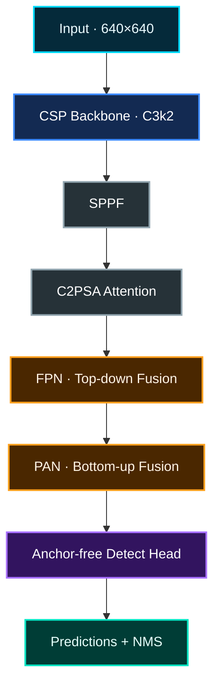
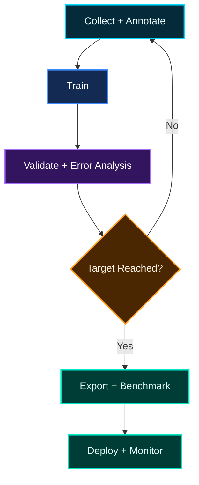

<div align="center">

# ◈ YOLO11 技術導覽

### REAL-TIME VISION · MULTI-TASK AI · EDGE-READY DEPLOYMENT

[](https://docs.ultralytics.com/models/yolo11/)
[](https://docs.ultralytics.com/models/yolo11/)
[](https://docs.ultralytics.com/models/yolo11/#supported-tasks-and-modes)
[](https://www.ultralytics.com/license)

**從模型概念、核心架構、任務類型與效能指標，一路理解訓練、驗證、推論及部署。**

<sub>繁體中文技術文件 · 更新日期：2026-07-19 · 資料以 Ultralytics 官方文件與程式碼為主</sub>

</div>

---

> [!NOTE]
> **版本定位**　[YOLO11](https://docs.ultralytics.com/models/yolo11/) 由 Ultralytics 於 2024 年 9 月發布。截至 2026 年 7 月，它已不是該公司最新一代模型，但仍具有成熟的 API、完整的多任務模型家族與廣泛的部署格式。對既有專案而言，是否升級應以資料集實測、硬體延遲、匯出相容性及維護成本決定，而不是只比較版本編號。

## NAVIGATION // 導覽

- [01｜核心概念](#core-concept)
- [02｜支援任務](#tasks)
- [03｜模型架構](#architecture)
- [04｜模型尺寸與效能](#scales)
- [05｜預訓練與遷移學習](#transfer-learning)
- [06｜完整工作流程](#workflow)
- [07｜資料集與標註格式](#dataset)
- [08｜評估指標](#metrics)
- [09｜信心門檻與 NMS](#postprocess)
- [10｜部署格式](#deployment)
- [11｜優勢、限制與適用情境](#tradeoffs)
- [12｜版本比較](#comparison)
- [13｜授權與引用](#license)
- [14｜關鍵名詞索引](#glossary)
- [15｜延伸閱讀](#further-reading)

---

<a id="core-concept"></a>

## 01 // 核心概念

### 1.1 YOLO11 是什麼？

[YOLO](https://arxiv.org/abs/1506.02640) 是 **You Only Look Once** 的縮寫。其核心思想是將物件定位與分類整合到同一個神經網路推論流程中。相較於先產生候選區域、再逐一分類的兩階段方法，YOLO 類模型通常更容易達到即時處理需求。

YOLO11 是 Ultralytics YOLO 系列中的多任務視覺模型家族，主要支援：

- [物件偵測 Object Detection](https://docs.ultralytics.com/tasks/detect/)；
- [實例分割 Instance Segmentation](https://docs.ultralytics.com/tasks/segment/)；
- [影像分類 Image Classification](https://docs.ultralytics.com/tasks/classify/)；
- [姿態估計 Pose Estimation](https://docs.ultralytics.com/tasks/pose/)；
- [旋轉框偵測 Oriented Bounding Boxes](https://docs.ultralytics.com/tasks/obb/)。

> [!TIP]
> 官方名稱是 **YOLO11**。網路文章有時寫成「YOLOv11」，但它不是所有 YOLO 研究分支共同遵循的統一版本名稱；在模型檔名、指令與引用中，建議使用官方命名 `YOLO11`。

### 1.2 「只看一次」真正代表什麼？

「You Only Look Once」不是指神經網路只有一層，也不是指影片只能分析一幀，而是指模型以單次前向傳播，同時產生物件位置與類別預測。

| 方法 | 典型流程 | 一般特性 |
|---|---|---|
| [兩階段偵測器](https://www.ultralytics.com/glossary/two-stage-object-detectors) | 候選區域 → 特徵分類與定位 | 定位能力強，但流程及部署通常較複雜 |
| [單階段偵測器](https://www.ultralytics.com/glossary/one-stage-object-detectors) | 特徵提取 → 同時輸出類別與位置 | 延遲較低，適合即時影像與邊緣部署 |

對 Detect 模型而言，一個結果通常可以表示為：

$$
(x_1, y_1, x_2, y_2, c, k)
$$

其中：

| 符號 | 意義 |
|---|---|
| $x_1,y_1,x_2,y_2$ | [Bounding Box](https://www.ultralytics.com/glossary/bounding-box) 左上角與右下角座標 |
| $c$ | [Confidence Score](https://www.ultralytics.com/glossary/confidence)，即模型對此預測的信心分數 |
| $k$ | 預測類別 ID |

---

<a id="tasks"></a>

## 02 // 支援任務

### 2.1 模型家族

YOLO11 透過檔名後綴區分任務，再透過 `n / s / m / l / x` 區分模型尺寸。

| 任務 | 檔名範例 | 主要輸出 | 典型用途 |
|---|---|---|---|
| Detect | `yolo11s.pt` | 矩形框、類別、信心分數 | 人員、車輛、零件、缺陷定位 |
| Segment | `yolo11s-seg.pt` | 遮罩、矩形框、類別、信心分數 | 瑕疵輪廓、面積量測、物件分離 |
| Classify | `yolo11s-cls.pt` | 整張影像的類別機率 | 良品／不良品、場景或物種分類 |
| Pose | `yolo11s-pose.pt` | 關鍵點及其信心分數 | 人體姿態、動作與安全行為分析 |
| OBB | `yolo11s-obb.pt` | 帶角度的旋轉矩形框 | 航拍、晶圓、傾斜零件與文字區域 |

這些模型都支援 **Train、Val、Predict、Export**；Tracking 則是建立在 Detect 或 Pose 等輸出上的運行模式，不是另一組獨立的 YOLO11 權重家族。

### 2.2 Detect 與 Segment 的視覺差異

| Object Detection | Instance Segmentation |
|:---:|:---:|
|  |  |
| 以矩形框標示物件位置 | 進一步輸出每個物件的像素輪廓 |

<div align="center"><sub>圖像來源：Ultralytics 官方 Detect 與 Segment 任務文件</sub></div>

### 2.3 實例分割與語意分割

| 比較項目 | 實例分割 | [語意分割](https://docs.ultralytics.com/tasks/semantic/) |
|---|---|---|
| 是否區分不同個體 | 是 | 通常否 |
| 兩輛相鄰汽車 | 產生兩組遮罩 | 汽車像素屬於同一類別圖層 |
| 典型輸出 | 每個實例的 mask、box、class、confidence | 一張逐像素類別圖 |
| 適用問題 | 物件計數、個別面積、輪廓追蹤 | 道路區域、背景、材料相區域 |

---

<a id="architecture"></a>

## 03 // 模型架構

### 3.1 整體資料流

YOLO11 的偵測架構可以分成 [Backbone](https://www.ultralytics.com/glossary/backbone)、Neck 與 Head 三個主要階段。官方架構說明指出，YOLO11 使用 `C3k2`、`SPPF`、`C2PSA`、FPN + PAN，以及 anchor-free、decoupled Detect head。



<div align="center"><sub>架構摘要依據：Ultralytics YOLO Architecture Guide 與 YOLO11 YAML</sub></div>

### 3.2 三個主要階段

| 階段 | 核心工作 | 輸出 |
|---|---|---|
| Backbone | 從像素提取邊緣、紋理、形狀及高階語意 | P3、P4、P5 等多解析度 feature maps |
| Neck | 透過 FPN 與 PAN 融合不同尺度資訊 | 兼具定位細節與語意資訊的多尺度特徵 |
| Head | 分別預測邊界框分布及類別分數 | 候選框、類別、信心分數 |

### 3.3 主要模組

#### `C3k2` // 特徵提取核心

`C3k2` 是建立在 CSP / C2f 思路上的模組，可依模型配置使用 Bottleneck 或 `C3k` 作為內部重複單元。它讓 YOLO11 在控制參數與 FLOPs 的同時重用多層特徵。

#### `SPPF` // 擴大感受野

`SPPF` 即 **Spatial Pyramid Pooling — Fast**。它串接多次池化結果，以較低成本整合不同感受野的資訊，有助於模型理解物件與周圍場景的關係。

#### `C2PSA` // 空間注意力

`C2PSA` 使用 Position-Sensitive Attention，使深層特徵更集中於具有辨識價值的空間區域。YOLO11 將它放在 SPPF 之後。

#### `FPN + PAN` // 多尺度融合

- [Feature Pyramid Network](https://arxiv.org/abs/1612.03144) 由上而下傳遞高階語意資訊；
- [Path Aggregation Network](https://arxiv.org/abs/1803.01534) 再由下而上補回定位細節；
- P3、P4、P5 分別對應 stride 8、16、32 的尺度特徵。

輸入為 $640\times640$ 時，大致可得到：

| 特徵層 | 約略大小 | 相對角色 |
|---|---:|---|
| P3 | $80\times80$ | 保留較多細節，較有利於小物件 |
| P4 | $40\times40$ | 平衡定位與語意資訊 |
| P5 | $20\times20$ | 感受野較大，適合大型物件與場景語意 |

#### Anchor-free + DFL

YOLO11 採用 [anchor-free](https://github.com/ultralytics/ultralytics/blob/main/docs/en/guides/yolo-architecture.md#anchor-free-decoupled-detect) 的解耦偵測頭：框回歸與類別預測走不同分支，不需要預先指定多組 anchor box 尺寸。

邊界框回歸使用 [Distribution Focal Loss, DFL](https://arxiv.org/abs/2006.04388) 的分布表示。YOLO11 的 `reg_max=16`，每個框座標以離散分布建模，再以期望值轉換為座標。

> [!IMPORTANT]
> YOLO11 仍需要 [Non-Maximum Suppression](https://www.ultralytics.com/glossary/non-maximum-suppression-nms) 移除重複框。不要將 YOLO11 與較新的 NMS-free end-to-end 架構混為一談。

---

<a id="scales"></a>

## 04 // 模型尺寸與效能

### 4.1 n、s、m、l、x

| 後綴 | 名稱 | 模型定位 | 一般適用情境 |
|---|---|---|---|
| `n` | Nano | 最小、延遲最低 | CPU、嵌入式裝置、快速 PoC |
| `s` | Small | 速度與精度平衡 | 多數即時應用的起始基準 |
| `m` | Medium | 提高模型容量 | 中階以上 GPU、精度優先 |
| `l` | Large | 大型模型 | 高階 GPU、較寬鬆的延遲限制 |
| `x` | Extra Large | 最大模型 | 離線分析或算力充足的精度實驗 |

### 4.2 官方 COCO Detect 基準

下表為官方在 COCO val2017、輸入尺寸 640 下公布的 Detect 模型結果。

| 模型 | mAP50–95 | CPU ONNX | T4 TensorRT 10 | 參數量 | FLOPs |
|---|---:|---:|---:|---:|---:|
| YOLO11n | 39.5 | 56.1 ms | 1.5 ms | 2.6 M | 6.5 B |
| YOLO11s | 47.0 | 90.0 ms | 2.5 ms | 9.4 M | 21.5 B |
| YOLO11m | 51.5 | 183.2 ms | 4.7 ms | 20.1 M | 68.0 B |
| YOLO11l | 53.4 | 238.6 ms | 6.2 ms | 25.3 M | 86.9 B |
| YOLO11x | 54.7 | 462.8 ms | 11.3 ms | 56.9 M | 194.9 B |

<div align="center"><sub>來源：<a href="https://docs.ultralytics.com/models/yolo11/#performance-metrics">Ultralytics YOLO11 Performance Metrics</a>。速度為指定環境下的模型基準，不等同完整應用程式延遲。</sub></div>

### 4.3 官方效能比較圖

<div align="center">
  
  <br>
  <sub>圖像來源：Ultralytics 官方 YOLO11 文件；實際專案結果應在目標資料與硬體上重新量測。</sub>
</div>

### 4.4 如何解讀基準數據

> [!WARNING]
> 官方速度通常聚焦於模型推論階段。實際系統還可能包含影像解碼、resize / letterbox、色彩轉換、NMS、遮罩重建、追蹤、繪圖、資料寫入與網路傳輸，因此不能直接用 `1000 ÷ 官方毫秒數` 當作完整系統 FPS。

模型選擇可以遵循以下原則：

1. 先以 `n` 或 `s` 建立可重現基準；
2. 在相同資料切分、輸入尺寸與訓練設定下比較；
3. 同時觀察 mAP、Recall、實際延遲、VRAM 與檔案大小；
4. 只有在精度增益足以抵銷成本時才升級到更大模型；
5. 資料不足、標註不一致或 domain shift 通常不能只靠放大模型解決。

---

<a id="transfer-learning"></a>

## 05 // 預訓練與遷移學習

YOLO11 官方權重已在大型通用資料集上訓練，可作為自訂任務的起點。這種重用既有視覺特徵的方法稱為 [Transfer Learning / Fine-tuning](https://docs.ultralytics.com/guides/model-training-tips/#pretrained-weights-and-transfer-learning)。

| 任務 | 常見預訓練資料集 | 預訓練權重的角色 |
|---|---|---|
| Detect | [COCO](https://cocodataset.org/) | 提供通用物件特徵與框定位能力 |
| Segment | COCO Segmentation | 提供物件輪廓與 mask 表徵能力 |
| Classify | [ImageNet](https://www.image-net.org/) | 提供通用影像分類特徵 |
| Pose | COCO Keypoints | 提供人體關鍵點表徵 |
| OBB | [DOTA](https://captain-whu.github.io/DOTA/) | 提供航拍旋轉框定位能力 |

### 使用預訓練權重

```python
from ultralytics import YOLO

# 載入已預訓練的 YOLO11s Detect 權重
model = YOLO("yolo11s.pt")

model.train(
    data="dataset.yaml",
    epochs=100,
    imgsz=640,
    device=0,
)
```

### 從隨機初始化開始

```python
from ultralytics import YOLO

# 只載入架構，不載入預訓練權重
model = YOLO("yolo11s.yaml")

model.train(
    data="dataset.yaml",
    epochs=300,
    imgsz=640,
    device=0,
)
```

> [!TIP]
> 對大多數自訂資料集，應先使用 `.pt` 預訓練權重。從 `.yaml` 隨機初始化通常需要更多資料、訓練時間與調參工作。

---

<a id="workflow"></a>

## 06 // 完整工作流程



### 6.1 安裝

```bash
pip install -U ultralytics
```

檢查環境：

```bash
yolo checks
```

參考：[Ultralytics Quickstart](https://docs.ultralytics.com/quickstart/)

### 6.2 Predict // 推論

```python
from ultralytics import YOLO

model = YOLO("yolo11s.pt")

results = model.predict(
    source="image.jpg",
    imgsz=640,
    conf=0.25,
)

for result in results:
    print(result.boxes.xyxy)  # [x1, y1, x2, y2]
    print(result.boxes.conf)  # confidence
    print(result.boxes.cls)   # class ID
```

長影片或即時串流應使用 `stream=True`，使結果逐幀產生，避免所有結果同時留在記憶體中：

```python
for result in model.predict(source="video.mp4", stream=True):
    process(result)
```

參考：[Predict Mode](https://docs.ultralytics.com/modes/predict/)

### 6.3 Train // 訓練

```python
from ultralytics import YOLO


def main() -> None:
    model = YOLO("yolo11s.pt")
    model.train(
        data="dataset.yaml",
        epochs=100,
        imgsz=640,
        batch=16,
        device=0,
        project="runs/detect",
        name="yolo11s_baseline",
    )


if __name__ == "__main__":
    main()
```

> [!NOTE]
> Windows 以 Python 腳本啟動訓練時，保留 `if __name__ == "__main__":` 可避免 multiprocessing 啟動錯誤。

參考：[Train Mode](https://docs.ultralytics.com/modes/train/)

### 6.4 Val // 驗證

```python
from ultralytics import YOLO

model = YOLO("runs/detect/yolo11s_baseline/weights/best.pt")
metrics = model.val(data="dataset.yaml")

print("mAP50-95:", metrics.box.map)
print("mAP50   :", metrics.box.map50)
print("mAP75   :", metrics.box.map75)
```

參考：[Validation Mode](https://docs.ultralytics.com/modes/val/)

### 6.5 Export // 匯出

```python
from ultralytics import YOLO

model = YOLO("best.pt")
model.export(
    format="onnx",
    imgsz=640,
    dynamic=False,
    batch=1,
)
```

參考：[Export Mode](https://docs.ultralytics.com/modes/export/)

---

<a id="dataset"></a>

## 07 // 資料集與標註格式

### 7.1 Detect 資料夾結構

```text
dataset/
├── images/
│   ├── train/
│   ├── val/
│   └── test/
├── labels/
│   ├── train/
│   ├── val/
│   └── test/
└── dataset.yaml
```

### 7.2 Dataset YAML

```yaml
path: dataset

train: images/train
val: images/val
test: images/test

names:
  0: person
  1: helmet
  2: vehicle
```

### 7.3 Detect 標籤

每一行表示一個物件：

```text
class_id x_center y_center width height
```

例如：

```text
1 0.512 0.463 0.125 0.238
```

所有座標均除以影像寬高，正規化至 $0\sim1$。

### 7.4 Segment 標籤

每一行由類別與多邊形頂點構成：

```text
class_id x1 y1 x2 y2 x3 y3 ... xn yn
```

例如：

```text
0 0.210 0.350 0.270 0.290 0.420 0.310 0.460 0.510
```

### 7.5 資料品質檢查

| 檢查項目 | 常見風險 | 建議 |
|---|---|---|
| Train / Val / Test 切分 | 連續影片相鄰幀被拆到不同集合，造成資料洩漏 | 依影片、場次、設備或日期分組切分 |
| 類別平衡 | 少數類別 Recall 過低 | 補充資料、調整採樣並查看 class-wise AP |
| 標註一致性 | 相同物件的框或遮罩規則不同 | 建立標註規範與抽樣複核制度 |
| 背景覆蓋 | 模型只記住特定背景 | 加入多場域、多光線與 hard negatives |
| 小物件像素量 | Resize 後資訊消失 | 提高 `imgsz`、裁切 ROI 或採 tiled inference |
| 重複影像 | 驗證結果虛高 | 使用 perceptual hash 或來源分組檢查 |

參考：[YOLO Dataset Guides](https://docs.ultralytics.com/datasets/) 與 [Data Collection and Annotation](https://docs.ultralytics.com/guides/data-collection-and-annotation/)

---

<a id="metrics"></a>

## 08 // 評估指標

### 8.1 Confusion Matrix 基礎量

| 符號 | 名稱 | 意義 |
|---|---|---|
| TP | True Positive | 正確偵測到目標 |
| FP | False Positive | 將背景或其他類別誤判成目標 |
| FN | False Negative | 真實目標未被偵測 |
| TN | True Negative | 正確判斷為非目標；偵測任務通常不直接逐框統計 |

### 8.2 Precision、Recall 與 F1

[Precision](https://www.ultralytics.com/glossary/precision) 衡量預測為正類的結果中，有多少是真的：

$$
Precision=\frac{TP}{TP+FP}
$$

Recall 衡量全部真實目標中，有多少被找到：

$$
Recall=\frac{TP}{TP+FN}
$$

F1 是兩者的調和平均：

$$
F1=2\cdot\frac{Precision\cdot Recall}{Precision+Recall}
$$

| 指標偏低 | 通常表示 | 優先檢查 |
|---|---|---|
| Precision 低 | 誤報偏多 | hard negatives、類別混淆、`conf`、標註錯誤 |
| Recall 低 | 漏檢偏多 | 小物件、遮擋、資料覆蓋、`conf` 過高 |
| F1 低 | Precision 與 Recall 整體失衡 | PR / F1 曲線與操作門檻 |

### 8.3 IoU

[Intersection over Union](https://www.ultralytics.com/glossary/intersection-over-union-iou) 衡量預測區域 $A$ 與標註區域 $B$ 的重疊程度：

$$
IoU=\frac{|A\cap B|}{|A\cup B|}
$$

IoU 越接近 1，代表預測與標註越重疊；但對邊界模糊或標註主觀性高的目標，嚴格 IoU 也會反映標註一致性，而不只是模型能力。

### 8.4 AP 與 mAP

[Average Precision](https://www.ultralytics.com/glossary/mean-average-precision-map#calculation-methodology) 是 Precision–Recall 曲線下面積；[mAP](https://www.ultralytics.com/glossary/mean-average-precision-map) 則是多類別 AP 的平均。

| 指標 | 計算方式 | 解讀 |
|---|---|---|
| mAP50 | IoU = 0.50 | 較寬鬆，重點是能否找到物件 |
| mAP75 | IoU = 0.75 | 更重視定位準確度 |
| mAP50–95 | IoU 0.50～0.95，每 0.05 計算後平均 | COCO 標準，最全面也最嚴格 |
| Box mAP | 用矩形框計算 | 評估偵測與定位 |
| Mask mAP | 用像素遮罩計算 | 評估實例分割輪廓 |

> [!IMPORTANT]
> 單一 mAP 無法回答所有產品問題。即時系統還應測量端到端 latency、FPS、峰值記憶體、漏檢成本、單位時間誤報數，以及不同場域條件下的穩定性。

參考：[YOLO Performance Metrics](https://docs.ultralytics.com/guides/yolo-performance-metrics/)

---

<a id="postprocess"></a>

## 09 // 信心門檻與 NMS

### 9.1 Confidence Threshold

```python
results = model.predict(
    source="image.jpg",
    conf=0.25,
)
```

| 調整方向 | 常見影響 |
|---|---|
| 降低 `conf` | 保留更多候選結果，Recall 可能上升，FP 也可能增加 |
| 提高 `conf` | 移除低信心預測，Precision 可能上升，FN 也可能增加 |

`conf=0.25` 只是常見起始值，不是所有資料集的最佳門檻。應根據 PR curve、F1 curve 及應用成本選擇操作點。

### 9.2 Non-Maximum Suppression

[NMS](https://www.ultralytics.com/glossary/non-maximum-suppression-nms) 會依信心分數排序候選框，保留較高分的框，再移除與其 IoU 過高的重複預測。

```python
results = model.predict(
    source="image.jpg",
    conf=0.25,
    iou=0.70,
)
```

> [!NOTE]
> Predict 的 `iou` 是 NMS 去除重複框所使用的門檻；`mAP50` 或 `mAP50–95` 中的 IoU 則是驗證預測是否與 ground truth 足夠重疊。兩者用途不同。

---

<a id="deployment"></a>

## 10 // 部署格式

| 格式 | `format` 參數 | 主要環境 | 特性 |
|---|---|---|---|
| PyTorch | — | Python / PyTorch | 訓練與驗證最完整，整合快速 |
| [TorchScript](https://pytorch.org/docs/stable/jit.html) | `torchscript` | PyTorch C++、部分行動環境 | 保留 PyTorch 生態相容性 |
| [ONNX](https://onnx.ai/) | `onnx` | 跨平台 Runtime | 通用性高，適合建立部署基準 |
| [OpenVINO](https://docs.openvino.ai/) | `openvino` | Intel CPU / GPU / NPU | 適合 Intel 硬體最佳化 |
| [TensorRT](https://docs.nvidia.com/deeplearning/tensorrt/) | `engine` | NVIDIA GPU | 可使用 FP16 / INT8 降低延遲 |
| [CoreML](https://developer.apple.com/documentation/coreml) | `coreml` | macOS / iOS | Apple 裝置原生推論 |
| TFLite | `tflite` | Android、嵌入式裝置 | 輕量化部署選項 |

### 部署驗證清單

- [ ] 匯出模型與原始 `.pt` 使用完全相同的測試資料；
- [ ] 比較框座標、類別、信心分數及 mask；
- [ ] 記錄 warm-up 後的 P50 / P95 / P99 latency；
- [ ] 分開量測 preprocess、inference、postprocess；
- [ ] 檢查 FP16 / INT8 量化造成的精度差異；
- [ ] 固定 Runtime、driver、CUDA、TensorRT 或 OpenVINO 版本；
- [ ] 在真正的目標硬體上測試，不只在開發電腦測試；
- [ ] 驗證異常輸入、串流中斷、空結果及記憶體長時間穩定性。

---

<a id="tradeoffs"></a>

## 11 // 優勢、限制與適用情境

### 11.1 優勢

| 面向 | 優勢 |
|---|---|
| 即時性 | 單階段設計，容易在 GPU 與部分 CPU 環境達到低延遲 |
| 多任務 | Detect、Segment、Classify、Pose、OBB 使用一致 API |
| 開發效率 | 訓練、驗證、預測、追蹤及匯出整合在同一套工具鏈 |
| 遷移學習 | 可利用 COCO、ImageNet 等預訓練權重縮短開發週期 |
| 模型尺度 | n 到 x 提供不同速度—精度組合 |
| 部署彈性 | 支援 ONNX、OpenVINO、TensorRT、CoreML 等格式 |
| 生態系 | 文件、範例、社群與第三方整合資源豐富 |

### 11.2 限制

| 限制 | 說明 | 常見補強方式 |
|---|---|---|
| 不具長期時間理解 | 基本模型逐幀推論，不會自然理解事件前後關係 | Tracking、滑動視窗、時序模型或事件邏輯 |
| Domain Shift | 相機、光線、背景或材料改變會降低泛化 | 現場資料、分層測試、持續監控與再訓練 |
| 小物件困難 | Resize 後可能只剩極少像素 | 提高解析度、裁切、SAHI / tiled inference |
| 標註敏感 | 框或遮罩規則不一致會限制模型上限 | 標註規範、雙人複核、錯誤分析 |
| 大模型成本 | 模型越大，延遲、VRAM 與部署成本越高 | 以 Pareto frontier 而非單一 mAP 選型 |
| NMS 依賴 | YOLO11 Detect 仍需後處理去除重複框 | 正確調整 conf / IoU 並驗證匯出後處理 |

### 11.3 適合使用 YOLO11

- 需要即時或近即時物件定位；
- 需要從少量至中型自訂資料集開始微調；
- 需要同一工具鏈支援 Detect、Segment 或 Pose；
- 需要部署到 Python、ONNX、OpenVINO 或 TensorRT；
- 專案已有 Ultralytics YOLO 資料格式及工程基礎。

### 11.4 不一定是最佳選擇

- 只需要整張影像的極簡二分類；
- 需要理解數十秒至數分鐘的複雜行為；
- 需要開放詞彙或文字提示式辨識；
- 目標極小且原圖非常大，但沒有裁切或 tiled inference；
- 閉源商業產品無法接受現有授權條件；
- 其他模型已在相同資料與硬體上取得更好的 Pareto 表現。

---

<a id="comparison"></a>

## 12 // 版本比較

| 項目 | YOLOv8 | YOLO11 | YOLO26 |
|---|---|---|---|
| 主要 Backbone block | `C2f` | `C3k2` | `C3k2` |
| Spatial pooling | `SPPF` | `SPPF` | `SPPF + shortcut` |
| Attention | — | `C2PSA` | `C2PSA` |
| Detect head | Anchor-free、decoupled | Anchor-free、decoupled | Anchor-free、end-to-end |
| DFL | `reg_max=16` | `reg_max=16` | 移除，`reg_max=1` |
| NMS | 需要 | 需要 | 可 NMS-free |
| 適用定位 | 成熟的前一代基準 | 速度—精度與工具鏈平衡 | 新一代 edge / end-to-end 方向 |

> [!TIP]
> 升級模型時，應在同一資料 split、同一 `imgsz`、同一硬體與相同部署 Runtime 下比較。新版本的官方 COCO 成績較高，不代表它必然在每一個自訂資料集上更好。

架構差異來源：[YOLO Architecture Explained](https://github.com/ultralytics/ultralytics/blob/main/docs/en/guides/yolo-architecture.md)

---

<a id="license"></a>

## 13 // 授權與引用

### 13.1 授權

Ultralytics 對 YOLO11 提供：

- [AGPL-3.0](https://github.com/ultralytics/ultralytics/blob/main/LICENSE)；
- [Ultralytics Enterprise License](https://www.ultralytics.com/license)。

> [!WARNING]
> AGPL-3.0 不等同於「任何閉源商業使用都不受限制」。若模型或程式碼將被整合進閉源產品、提供網路服務或交付客戶，應依實際架構、散布方式及使用情境進行授權評估。本文不構成法律意見。

### 13.2 官方建議引用格式

Ultralytics 未為 YOLO11 發布正式研究論文；官方建議將其作為軟體引用：

```bibtex
@software{yolo11_ultralytics,
  author  = {Glenn Jocher and Jing Qiu},
  title   = {Ultralytics YOLO11},
  version = {11.0.0},
  year    = {2024},
  url     = {https://github.com/ultralytics/ultralytics},
  license = {AGPL-3.0}
}
```

引用說明來源：[Ultralytics YOLO11 — Citations and Acknowledgments](https://docs.ultralytics.com/models/yolo11/#citations-and-acknowledgments)

---

<a id="glossary"></a>

## 14 // 關鍵名詞索引

| 名詞 | 快速定義 | 參考連結 |
|---|---|---|
| Anchor-free | 不使用預先定義的 anchor box 尺寸，直接從網格點預測框 | [Architecture Guide](https://github.com/ultralytics/ultralytics/blob/main/docs/en/guides/yolo-architecture.md#anchor-free-decoupled-detect) |
| Backbone | 將輸入像素轉換成多層級特徵圖的主幹網路 | [Ultralytics Glossary](https://www.ultralytics.com/glossary/backbone) |
| Bounding Box | 以矩形表示物件位置 | [Ultralytics Glossary](https://www.ultralytics.com/glossary/bounding-box) |
| Confidence Score | 模型對特定預測的信心分數 | [Ultralytics Glossary](https://www.ultralytics.com/glossary/confidence) |
| DFL | 將框座標建模成離散機率分布的回歸方法 | [Generalized Focal Loss Paper](https://arxiv.org/abs/2006.04388) |
| Feature Map | 神經網路中間層所產生的空間特徵表示 | [Feature Extraction](https://www.ultralytics.com/glossary/feature-extraction) |
| Fine-tuning | 從預訓練權重出發，以自訂資料更新模型 | [Fine-tuning Guide](https://docs.ultralytics.com/guides/finetuning-guide/) |
| FLOPs | 一次前向運算所需的浮點運算量估計 | [Ultralytics Glossary](https://www.ultralytics.com/glossary/flops) |
| FPN | 由上而下融合不同尺度特徵的金字塔網路 | [FPN Paper](https://arxiv.org/abs/1612.03144) |
| IoU | 預測區域與標註區域的交集除以聯集 | [Ultralytics Glossary](https://www.ultralytics.com/glossary/intersection-over-union-iou) |
| mAP | 不同類別 AP 的平均；常用於比較偵測與分割模型 | [Ultralytics Glossary](https://www.ultralytics.com/glossary/mean-average-precision-map) |
| NMS | 根據 confidence 與 IoU 移除重複框 | [Ultralytics Glossary](https://www.ultralytics.com/glossary/non-maximum-suppression-nms) |
| OBB | 帶角度的旋轉矩形框 | [OBB Task](https://docs.ultralytics.com/tasks/obb/) |
| PAN | 由下而上補強定位資訊的特徵融合路徑 | [PANet Paper](https://arxiv.org/abs/1803.01534) |
| Precision | 所有正類預測中，真正正類所占比例 | [Ultralytics Glossary](https://www.ultralytics.com/glossary/precision) |
| Recall | 所有真實正類中，被模型找出的比例 | [Performance Metrics](https://docs.ultralytics.com/guides/yolo-performance-metrics/) |
| Transfer Learning | 將大型資料集學到的特徵轉用於新任務 | [Training Tips](https://docs.ultralytics.com/guides/model-training-tips/#pretrained-weights-and-transfer-learning) |

---

<a id="further-reading"></a>

## 15 // 延伸閱讀

### A. YOLO11 官方核心資料

1. [Ultralytics YOLO11 Model Overview](https://docs.ultralytics.com/models/yolo11/)  
   模型定位、任務家族、官方 COCO 效能與基本用法。

2. [YOLO Architecture Explained](https://github.com/ultralytics/ultralytics/blob/main/docs/en/guides/yolo-architecture.md)  
   從 YOLOv3 到 YOLO26 的 Backbone、Neck、Head、anchor-free 與 NMS-free 演進。

3. [YOLO11 Model YAML](https://github.com/ultralytics/ultralytics/blob/main/ultralytics/cfg/models/11/yolo11.yaml)  
   YOLO11 Detect 的實際層級配置、scale、參數量與 P3/P4/P5 輸出。

4. [Ultralytics GitHub Repository](https://github.com/ultralytics/ultralytics)  
   原始程式碼、版本發布、Issue、模型模組與授權檔案。

### B. 訓練與評估

5. [Model Training](https://docs.ultralytics.com/modes/train/)  
   訓練參數、GPU / CPU / Apple Silicon、resume 與多 GPU 訓練。

6. [Validation Mode](https://docs.ultralytics.com/modes/val/)  
   驗證參數、速度測量與 metrics API。

7. [YOLO Performance Metrics](https://docs.ultralytics.com/guides/yolo-performance-metrics/)  
   Precision、Recall、F1、IoU、mAP 與各類輸出圖的解讀。

8. [Fine-tuning Guide](https://docs.ultralytics.com/guides/finetuning-guide/)  
   預訓練權重、凍結層、兩階段 fine-tuning 與常見問題。

9. [Dataset Guides](https://docs.ultralytics.com/datasets/)  
   Detect、Segment、Pose、OBB 與 Classification 的資料格式。

### C. 推論與部署

10. [Predict Mode](https://docs.ultralytics.com/modes/predict/)  
    圖片、影片、Webcam、RTSP、多串流及 `Results` 物件。

11. [Export Mode](https://docs.ultralytics.com/modes/export/)  
    ONNX、OpenVINO、TensorRT、CoreML、量化與動態輸入。

12. [ONNX Documentation](https://onnx.ai/onnx/intro/)  
    跨框架模型交換格式與圖運算概念。

13. [NVIDIA TensorRT Documentation](https://docs.nvidia.com/deeplearning/tensorrt/)  
    NVIDIA GPU 推論最佳化、precision 與 engine 建置。

14. [OpenVINO Documentation](https://docs.openvino.ai/)  
    Intel CPU、GPU、NPU 的推論與效能調整。

### D. 基礎論文

15. [You Only Look Once: Unified, Real-Time Object Detection](https://arxiv.org/abs/1506.02640)  
    原始 YOLO 論文，理解單階段偵測思想的起點。

16. [Feature Pyramid Networks for Object Detection](https://arxiv.org/abs/1612.03144)  
    FPN 的多尺度特徵融合方法。

17. [Path Aggregation Network for Instance Segmentation](https://arxiv.org/abs/1803.01534)  
    PANet 的雙向特徵傳遞概念。

18. [Generalized Focal Loss](https://arxiv.org/abs/2006.04388)  
    YOLO11 邊界框分布回歸所使用 DFL 思路的來源。

---

<div align="center">

### ◈ FINAL SIGNAL

**YOLO11 的價值不只是一組權重，而是一套從資料、訓練、評估到跨平台部署的完整視覺工程介面。**

<sub>選擇模型時，同時比較 Accuracy × Latency × Memory × Robustness × License。</sub>

</div>
